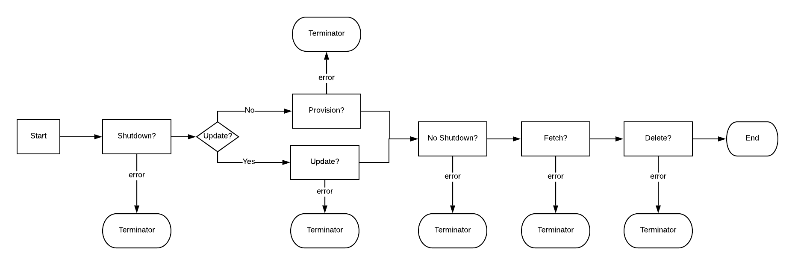

# Solace Provision

solace-provision is a tool which reads flat files to provision solace hardware appliances and software brokers.

## Project Status

Currently in *beta*

Build Status: [](https://travis-ci.com/unixunion/solace-provision)

Capabilities:

    * Fetch + Save to disk
    * Provision
    * Update
    * Shutdown
    * Enable
    * Delete

Objects that can be managed

    * VPN
    * Queue
    * Queue Subscription
    * Topic Endpoints
    * Sequenced Topic
    * ACL Profile
    * ACL Publish Exception
    * ACL Subscribe Exception
    * Client Profile
    * Client Username
    * Authorization Groups
    * Bridge
    * Remote Bridge VPN
    * Replay Log
    * DMR Cluster
    
Refactor Completed List
    
    * ACL
    
    
This tool is subject to [SEMPv2 limitations](https://docs.solace.com/SEMP/SEMP-API-Versions.htm#SEMPv2).

## Requirements

### Solace Requirements

* A Recent version of Solace PubSub 9.x+ or HW Appliance 8.4+.
* Config-sync enabled between routers.

### Optional, but Highly Recommended 

* TLS enabled SEMP service *( otherwise some types of secrets cannot be provisioned )*
* CA certificate in either:
    * System certificate chain
    * Appliance [config.yaml](examples/config_solace1.yaml) file

### Compiling Requirements

rust 1.33 *or* docker

### Testing

```
docker-compose up -d
(Wait for solace to be ready)
sh clean.sh examples/config.yaml testvpn
RUST_BACKTRACE=full  RUST_LOG=solace_provision  cargo test --  --test-threads=1
docker-compose down
```

# Usage

<i>solace-provision</i> reads YAML files from disk which are used to provision Solace managed objects. see `solace-provision --help` 
for more and solace-provision \[<i>subcommand</i>\] --help

Example:

    solace-provision --config config.yaml vpn\
        --message-vpn myvpn \
        --file vpnspec.yaml \
        --shutdown \
        --update \
        --no-shutdown

## Config and Spec files

<i>Config</i> file refers to the Solace REST API settings, e.g `hostname`, `username` and `password`.

<i>Spec</i> files refers to the YAML files which describe the various Solace manageable objects.

### Configuring SEMPv2 Client

solace-provision requires a config file to provide the Solace REST API endppoint and credentials.

Example Config:
```yaml
username: admin
password: admin
host: https://localhost:8080/SEMP/v2/config
ok_emoki: 👍
err_emoki: 🔥
certs:
  - |
    -----BEGIN CERTIFICATE-----
    MIIFfzCCA2egAwIBAgIJAOFbdgBoLz0qMA0GCSqGSIb3DQEBCwUAMFYxCzAJBgNV
    ...

```

See [examples/config.yaml](examples/config_solace1.yaml) 

### Spec Files

YAML files are used to provision and configure Solace managed objects, all keys and possible values can be found within the 
OpenAPI spec. I provide a build-tool for generating the API, see: [solace_semp_client](https://github.com/unixunion/solace_semp_client.git)

Examples Provision Files:

* [vpn.yaml](examples/vpn.yaml) 
* [queue1.yaml](examples/queue1.yaml)
* [queue-subscription.yaml](examples/queue-subscription.yaml)
* [topic-endppoint.yaml](examples/topicendpoint.yaml)
* [sequenced-topic.yaml](examples/sequenced-topic.yaml)
* [acl.yaml](examples/acl.yaml)
* [client-profile.yaml](/examples/client-profile.yaml)
* [client-username.yaml](/examples/client-username.yaml)
* [bridge.yaml](/examples/bridge-primary.yaml)
* [bridge-remote.yaml](examples/bridge-remote-primary.yaml)
* [replay.yaml](examples/replay.yaml)

## Provisioning

When provisioning, consider the order of dependencies between items e.g: 

`VPN <- ACL <- CLIENT-PROFILE <- CLIENT-USERNAME <- QUEUE`

IMPORTANT: the <i>msgVpnName</i> key within the various yaml files is overridden at provision-time with the `--message-vpn` arg,
which is a mandatory arg for *all* operations.

Executable quick overview:

```bash
solace-provision --config {CLIENT_CONFIG} \
                [--output {FETCH_OUTDIR}] \
                acl-profile|auth-group|bridge|client-profile|client-username|queue|queue-subscription|remote-bridge|replay-log|sequenced-topic|topic-endpoint|vpn \
                --message-vpn {VPN_NAME} \
                [--queue|--acl-profile|--client-profile|--client-username|bridge] {ITEM_NAME}] \
                [--virtual-router primary|backup|auto] \
                [--file {ITEM_YAML}] \
                [--update] \
                [--shutdown|--shutdown-egress|--shutdown-ingress] \
                [--no-shutdown|--no-shutdown-egress|--no-shutdown-ingress] \
                [--fetch]
```

### Order of Operation

solace-provision performs all operations the order depicted below, any operation that fails will result in the process terminating.



### Error Prevention

Due to limitations in the SEMPv2 spec, many attributes are passed as string directly to the appliance, this means you could pass 
invalid / out-of-spec values, resulting in the provision aborting. Therefore you should ensure your strategy involves applying changes
to test vpns / appliances before attempting production changes. As the diagram above shows, if you attempt to update a vpn
while shutting it down, if the update fails you will be left with a vpn in shutdown mode as no further operations will be performed.

Tip, the `--message-vpn` arg will override the VPN a object is being made / updated in, so use it to apply your change to a sandbox 
VPN before targeting the change at a in-use one.

### Logging

Logging is configured with the `RUST_LOG` environment variable, set to `[warn|error|info|debug]`. Example:

    RUST_LOG=solace_provision solace-provision ...
    RUST_LOG=solace_provision=error solace-provision ...

### Running

solace-provision takes args both within the subcommand scope and outside of it. Outside subcommand args are:

    --config file MANDATORY
    --output OPTIONAL: save path for "fetch" operations 
    --count n OPTIONAL: items per "fetch", default=10


### Downloading Entire VPN's

```bash
  RUST_LOG=solace_provision solace-provision --output output --config examples/config-hw.yaml vpn --fetch --message-vpn "*"
  RUST_LOG=solace_provision solace-provision --count 1024  --output output --config examples/config-hw.yaml queue --fetch --message-vpn ci1_somevpn --queue "*"
  RUST_LOG=solace_provision solace-provision --count 1024  --output output --config examples/config-hw.yaml acl --fetch --message-vpn ci1_somevpn --acl-profile "*"
  RUST_LOG=solace_provision solace-provision --count 1024  --output output --config examples/config-hw.yaml acl-profile --fetch --message-vpn ci1_somevpn --acl-profile "*"
  RUST_LOG=solace_provision solace-provision --count 1024  --output output --config examples/config-hw.yaml client-profile --fetch --message-vpn ci1_somevpn --client-profile "*"
  RUST_LOG=solace_provision solace-provision --count 1024  --output output --config examples/config-hw.yaml client-username --fetch --message-vpn ci1_somevpn --client-username "*"
```

## Compiling From Source

solace-provision is compiled against [rust_solace_semp_client](https://github.com/unixunion/rust_solace_semp_client.git).
As new versions of the SEMPv2 spec are release, they can be generated into rust code with [solace_semp_client](https://github.com/unixunion/solace_semp_client.git).

### Building with cargo

```bash
cargo build --release
```

### Using Docker

```bash
docker run -v `pwd`:/src rust:1.33 /src/mkrelease.sh
```
### Building Docker Image

```bash
docker run -v `pwd`:/src rust:1.33 /src/mkrelease.sh
docker build -t solace-provision:0.1.4-beta .
docker run --net=host -e "RUST_LOG=debug" -v`pwd`:/opt solace-provision:0.1.4-beta --config /opt/examples/config.yaml vpn --fetch --message-vpn "*"
```

## Local Development

### Start Solace

    docker-compose up -d
    
### Manually enable TLS
    
Once the appliance is up, TLS must be enabled for SEMPv2. A development rootCA and localhost cert is available under [certs/](certs/), 
and you can follow Solace's documentation for setting it up with those or your own certs.

* Configure TLS for SEMP: https://docs.solace.com/Configuring-and-Managing/TLS-SSL-Service-Connections.htm#managing_tls_ssl_service_1762742558_317096
* Generating CA and Certs: https://gist.github.com/fntlnz/cf14feb5a46b2eda428e000157447309
* You can run the CA+Cert commands in /usr/sw/jail/certs on the router, access it with `docker-compose exec solace bash`
* Combine the server.crt and server.key into a single pem `cat localhost.crt localhost.key >>localhost.pem`
* enable TLS for SEMP as described in Solace Docs
* add the non-trusted rootca cert on client system and trust it, on the systems which will run the solace-provision tool. 
e.g: keychain import into System chain on mac + trust the cert.


```bash
77528f005592> enable 
77528f005592# configure 
77528f005592(configure)# service semp shutdown
77528f005592(configure)# authentication
77528f005592(configure/authentication)# certificate-authority rootCa.crt
77528f005592(configure)# ssl 
77528f005592(configure/ssl)# server-certificate localhost.pem
77528f005592(configure)# service semp listen-port 8080 ssl
77528f005592(configure)# service semp no shutdown ssl

```

Testing TLS:

    curl -k --cacert ./certs/rootCa.crt https://localhost:8080/SEMP/v2/config 

## References

* https://docs.solace.com/API-Developer-Online-Ref-Documentation/swagger-ui/index.html
* https://github.com/swagger-api/swagger-codegen/blob/master/samples/client/petstore/rust/examples/client.rs

